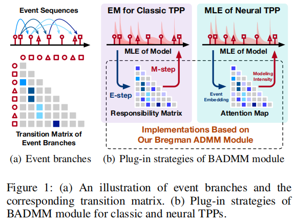

# BADMM_TPP

[](https://aaai.org/)


> **Official Implementation of AAAI 2025 Paper:** "A Plug-and-Play Bregman ADMM Module for Inferring Event Branches in Temporal Point Processes"

## 📖 Overview

This repository contains the official implementation of our AAAI 2025 paper, introducing a novel **BADMM (Bregman Alternating Direction Method of Multipliers)** module for temporal point processes (TPP). Our plug-and-play module enhances existing TPP models by effectively inferring event branches through advanced regularization techniques.




## 🚀 Quick Start

### Prerequisites

- **Python**: 3.8.1
- **PyTorch**: 1.13.1

### Installation

```bash
# Clone the repository
git clone <repository-url>
cd BADMM_TPP

# Create and activate conda environment
conda create -n badmm_tpp python=3.8.1
conda activate badmm_tpp

# Install dependencies
pip install torch==1.13.1
```

## 📊 Datasets

Download the datasets from [Google Drive](https://drive.google.com/drive/folders/0BwqmV0EcoUc8UklIR1BKV25YR1U?resourcekey=0-OrlU87jyc1m-dVMmY5aC4w) and place them in the parent directory as `data/`.

### Available Datasets

- **Conttime**: Continuous-time event sequences
- **Retweet**: Social media retweet patterns
- **StackOverflow**: Question-answer interactions
- **Amazon**: E-commerce transaction data
- **Taobao**: Online shopping behavior data

### Special Dataset: 12 Angry Men

We also include the famous film *"12 Angry Men"* to demonstrate the practical applicability of our module in real-world temporal analysis scenarios.


## 🏃‍♂️ Training

Our BADMM module integrates seamlessly with existing TPP architectures. We evaluate its performance on:

- **HP** (Hawkes Process) - Classic point process model [(Zhou et al., 2013b)](https://arxiv.org/abs/1304.5991)
- **THP** (Transformer Hawkes Process) - Transformer-based TPP [(Zuo et al., 2020)](https://arxiv.org/abs/2002.09291)
- **SAHP** (Self-Attentive Hawkes Process) - Attention mechanism TPP [(Zhang et al., 2020)](https://arxiv.org/abs/1907.07561)

### HP Model Training

```bash
cd HP

# BADMM with nuclear norm regularization
python main.py -data ../data/retweet/ -mode BADMM_nuclear -alpha alpha -lambd lambd

# BADMM with ℓ₁₂ regularization
python main.py -data ../data/retweet/ -mode BADMM_12 -alpha alpha -lambd lambd

# Expectation-Maximization baseline
python main.py -data ../data/retweet/ -mode EM

# 12 Angry Men dataset
python main_12_angry_men.py -mode BADMM_nuclear
```

### THP & SAHP Model Training

```bash
# THP Model
cd THP
python main.py -data <your data path>  -mode badmm -n_it n_it -lambda_ lambda_ -alpha alpha
python main.py -data <your data path>  -mode badmm12 -n_it n_it -lambda_ lambda_ -alpha alpha
python main.py -data <your data path>  -mode sinkhorn -n_it n_it
python main.py -data <your data path>  -mode softmax

# SAHP Model
cd SAHP
python main.py -data <your data path>  -mode badmm -n_it n_it -lambda_ lambda_ -alpha alpha
python main.py -data <your data path>  -mode badmm12 -n_it n_it -lambda_ lambda_ -alpha alpha
python main.py -data <your data path>  -mode sinkhorn -n_it n_it
python main.py -data <your data path>  -mode softmax
```

## ⚙️ Parameters

| Parameter | Description | Default | Range/Options |
|-----------|-------------|---------|---------------|
| `n_it` | Number of Bregman ADMM/Sinkhorn iterations | 2 | ≥ 1 |
| `alpha` | Regularization weight | - | (0, 1) |
| `lambda_` | Regularization strength | - | {0.01, 0.1, 1, 10, 100} |
| `mode` | Inference module | - | badmm, badmm12, sinkhorn, softmax |

## 📈 Performance

Our BADMM module demonstrates superior performance across multiple TPP architectures and datasets. Key advantages include:

- **Plug-and-Play Integration**: Easy integration with existing TPP models
- **Enhanced Branch Inference**: Better identification of event dependencies
- **Robust Regularization**: Multiple regularization options for different scenarios
- **Computational Efficiency**: Optimized ADMM iterations

## 🔬 Citation

If you find this work useful, please cite our paper:

```bibtex
@inproceedings{wang2025plug,
  title={A Plug-and-Play Bregman ADMM Module for Inferring Event Branches in Temporal Point Processes},
  author={Wang, Qingmei and Wu, Yuxin and Long, Yujie and Huang, Jing and Ran, Fengyuan and Su, Bing and Xu, Hongteng},
  booktitle={Proceedings of the AAAI Conference on Artificial Intelligence},
  volume={39},
  number={20},
  pages={21216--21224},
  year={2025}
}
```


## 🤝 Contributing

We welcome contributions! Please feel free to submit issues and pull requests.

